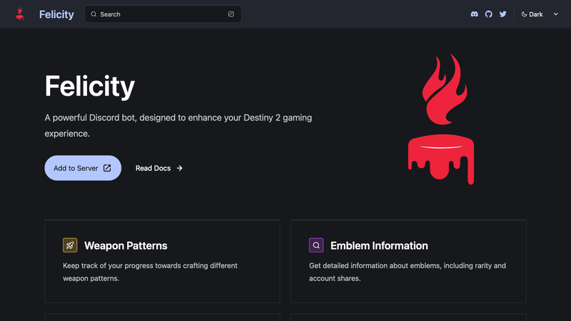

An image with a height of 100px:

An image without a height:

A local image, automatically processed by Astro assets support:

for the memes
<iframe width="560" height="315" src="https://www.youtube.com/embed/dQw4w9WgXcQ?si=G7YuhKpPkLFnXKQb&" title="YouTube video player" frameborder="0" allow="accelerometer; autoplay; clipboard-write; encrypted-media; gyroscope; picture-in-picture; web-share" allowfullscreen></iframe>

<iframe width="297" height="527" src="https://www.youtube.com/embed/GOihOAcIgMw" title="😓 Web dev&#39;s biggest buzzword, explained? #webdevelopment #programming" frameborder="0" allow="accelerometer; autoplay; clipboard-write; encrypted-media; gyroscope; picture-in-picture; web-share" allowfullscreen></iframe>